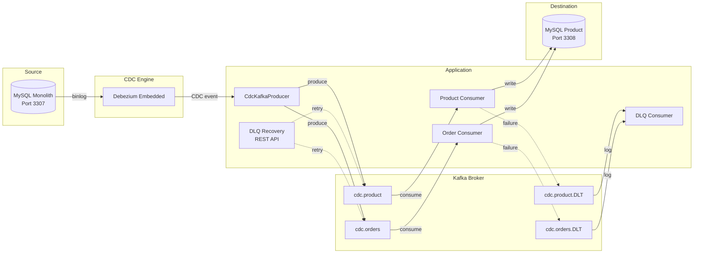

# Debezium Embedded MySQL CDC with Kafka

This project demonstrates the **Strangler Fig Pattern** by replicating data from a Monolith database to a Microservice database using **Debezium Embedded** and **Apache Kafka**. Debezium captures row-level changes (CDC) from MySQL, publishes them to Kafka topics, and dedicated consumers write the events to the destination database. **Dead Letter Queues (DLQ)** handle processing failures with a REST API for manual recovery.

## Architecture



### Components

| Component | Description |
|-----------|-------------|
| **MySQL Monolith** (Port 3307) | Source database with `product` and `orders` tables |
| **Debezium Embedded** | Captures binlog changes and produces CDC events |
| **CdcKafkaProducer** | Routes CDC events to per-table Kafka topics |
| **Kafka Topics** | `cdc.product` and `cdc.orders` — buffer CDC events |
| **CdcKafkaConsumer** | Listens to Kafka topics and writes to destination DB |
| **Dead Letter Topics** | `cdc.product.DLT` and `cdc.orders.DLT` — capture failed events |
| **DLQ Recovery API** | REST endpoints to inspect and retry failed events |
| **MySQL Product** (Port 3308) | Destination database with replicated tables |

### Event Flow

1. **Debezium** reads MySQL binlog from the monolith
2. **CdcEventHandler** extracts the table name and record key, then dispatches to **CdcKafkaProducer**
3. **CdcKafkaProducer** publishes the raw CDC JSON to the appropriate Kafka topic (`cdc.product` or `cdc.orders`)
4. **CdcKafkaConsumer** listens to each topic and applies the change (INSERT/UPDATE/DELETE) to the destination database
5. If processing fails after 3 retries, the event is automatically sent to the **Dead Letter Topic** (`.DLT`)
6. **DlqConsumer** logs every failed event for observability
7. **DlqRecoveryController** provides REST endpoints to inspect and retry failed events

## Prerequisites

*   Docker and Docker Compose
*   Java 21 (optional, if running locally)

## Getting Started

1.  **Start the environment**:
    ```bash
    docker compose down -v && docker compose up -d --build
    ```
    *This will start Zookeeper, Kafka, both MySQL instances, and the Spring Boot application.*

2.  **Verify Initial Snapshot**:
    The application automatically performs an initial snapshot of the 5 products existing in the Monolith. Check the destination:
    ```bash
    ./scripts/check-replication.sh
    ```

## Testing CDC Replication

### 1. Insert a new product or order
Run the helper scripts to insert records into the Monolith:
```bash
./scripts/add-product.sh "Gaming Monitor" "4K 144Hz" 599.90
./scripts/add-order.sh 1 5 "buyer@example.com"
```

### 2. Verify the change
Check the Microservice database to see the replicated record:
```bash
./scripts/check-replication.sh
```

### 3. Verify Kafka Topics
List the Kafka topics and inspect messages:
```bash
# List topics
docker exec kafka kafka-topics --list --bootstrap-server localhost:9092

# Consume recent product events
docker exec kafka kafka-console-consumer --topic cdc.product --bootstrap-server localhost:9092 --from-beginning --max-messages 5
```

### 4. REST API
You can interact with the Microservice data via its REST API:
*   `GET http://localhost:8080/api/products`
*   Example calls are available in `http/products.http`.

### 5. More scripts
#### 5.1 Verify initial snapshot
```bash
docker exec -it mysql-product mysql -uroot -proot -e "SELECT * FROM product.product;"
```

#### 5.2 Insert data
```bash
docker exec -it mysql-monolith mysql -uroot -proot -e \
  "INSERT INTO monolith.product (name, description, price) VALUES ('New Product', 'CDC test product description', 29.90);"
```

#### 5.3 Check replication
```bash
docker exec -it mysql-product mysql -uroot -proot -e "SELECT * FROM product.product;"
```

#### 5.4 Update data
```bash
docker exec -it mysql-monolith mysql -uroot -proot -e \
  "UPDATE monolith.product SET price = 99.90 WHERE id = 1;"
```

#### 5.5 Delete data
```bash
docker exec -it mysql-monolith mysql -uroot -proot -e \
  "DELETE FROM monolith.product WHERE id = 2;"
```

#### 5.6 Check offsets
```bash
docker exec -it mysql-product mysql -uroot -proot -e "SELECT * FROM product.debezium_offset_storage;"
```

#### 5.7 Trigger Ad-Hoc Snapshot
**What are Ad-Hoc Incremental Snapshots?**
Normally, Debezium makes snapshot of all tables on the first run and then reads the change events by binlog. Sometines you need to resync specifics tables, for example, deleted data and need to restore it, or you added a new table and need to capture it.
In these cases, you can request this Ad-Hoc incremental snapshots by sending signals to Debezium, in this case, add a record in the `debezium_signal` table.
It won't stop the connector or stop reading binlogs, so you can continue using the applicaiton normally.
The table reading is done in chunks to avoid performance issues.
Important: The signal table must be created in the *source database*.

Refs:
- https://debezium.io/documentation/reference/stable/configuration/signalling.html#debezium-signaling-overview
- https://debezium.io/documentation/reference/stable/connectors/mysql.html#debezium-mysql-incremental-snapshots


```bash
./scripts/trigger-snapshot.sh
```

## Dead Letter Queue (DLQ)

When a CDC event fails to be processed after 3 retry attempts, it is automatically sent to a Dead Letter Topic (`.DLT`). These events are logged by the `DlqConsumer` for observability.

### DLQ REST API

| Method | Endpoint | Description |
|--------|----------|-------------|
| `GET` | `/api/dlq/count/{topic}` | Get count of pending DLQ messages for a topic |
| `POST` | `/api/dlq/retry/{topic}` | Retry all DLQ messages by republishing to the original topic |

**Examples:**
```bash
# Check pending DLQ messages for products
curl http://localhost:8080/api/dlq/count/cdc.product

# Retry all failed product events
curl -X POST http://localhost:8080/api/dlq/retry/cdc.product
```

### Check application logs
```bash
# View all CDC-related log messages
docker logs poc-debezium-app 2>&1 | grep -E "CDC event|UPSERT|DELETE|DLQ|Retry"
```

## Configuration Highlights

*   **Connector**: `MySqlConnector`
*   **Offset Storage**: `JdbcOffsetBackingStore` persist in destination MySQL.
*   **Kafka**: Confluent Kafka 7.6.0 with auto topic creation enabled.
*   **Consumer**: Manual acknowledgment with 3 retries and 1s backoff before DLQ.
*   **Producer**: Idempotent with `acks=all` for exactly-once semantics.
*   **Data Handling**: `decimal.handling.mode=string` to ensure numeric precision in JSON.
*   **Lifecycle**: Managed by Spring `SmartLifecycle` to ensure clean startup and shutdown.

## Environment Variables

| Variable | Default | Description |
|----------|---------|-------------|
| `SPRING_DATASOURCE_URL` | `jdbc:mysql://localhost:3308/product` | Destination database URL |
| `DEBEZIUM_SOURCE_HOST` | `localhost` | Monolith MySQL host |
| `DEBEZIUM_SOURCE_PORT` | `3307` | Monolith MySQL port |
| `DEBEZIUM_SOURCE_DATABASE` | `monolith` | Source database name |
| `DEBEZIUM_SOURCE_TABLE_INCLUDE` | `monolith.product,monolith.orders` | Tables to capture |
| `KAFKA_BOOTSTRAP_SERVERS` | `localhost:29092` | Kafka bootstrap servers |
